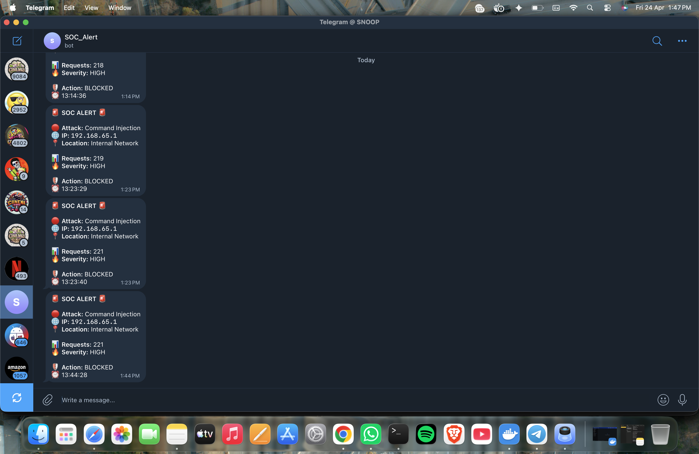

<h1 align="center">🛡️ SOCSight</h1>
<p align="center">
Real-Time Threat Detection & SOC Simulation Platform
</p>

<p align="center">
Detect • Analyze • Respond • Visualize
</p>

# 🔐 SOCSight Threat Detection System

🚀 A real-time **SOC (Security Operations Center) simulation platform** that detects, analyzes, and responds to cyber attacks using SIEM + SOAR concepts.

---

## 🧠 Overview

SOCSight is designed to replicate how a real SOC team works:

* 🔍 Collect logs
* ⚠️ Detect attacks
* 📊 Analyze behavior
* 🛡️ Respond automatically
* 📲 Alert analysts in real-time

---

## 🚀 Key Features

### 🔍 Detection Engine

* SQL Injection detection
* XSS (Cross-Site Scripting)
* Command Injection
* Brute Force attempts
* Suspicious activity patterns

### 🧠 ML Anomaly Detection

* Detects unusual traffic behavior
* Flags unknown attack patterns

### 🛡️ MITRE ATT&CK Mapping

* Maps attacks to real-world tactics & techniques
* Helps analysts understand attacker behavior

### 📊 Attacker Profiling

* Tracks attacker IPs
* Counts attacks & requests
* Calculates **risk score**

### ⚠️ Threat Scoring System

* LOW / MEDIUM / HIGH severity classification
* Based on attack frequency + anomaly detection

### 🌍 Geo Intelligence

* Displays attacker location (Geo-IP)
* Detects internal vs external traffic

### 🤖 Automated Response (SOAR)

* Simulated blocking of malicious IPs
* Real-time response actions

### 📲 Telegram Alerts

* SOC-style alert messages
* Includes:

  * Attack type
  * IP address
  * Location
  * Severity
  * Action taken

## 🏗️ Architecture


## 🏗️ Architecture

| Component     | Technology       |
| ------------- | ---------------- |
| Frontend      | Streamlit        |
| Backend       | Python           |
| Log Source    | DVWA + Apache    |
| Log Pipeline  | Logstash         |
| Storage       | Elasticsearch    |
| Visualization | Kibana           |
| Alerting      | Telegram Bot API |

---

## 📸 Screenshots

### 📊 Dashboard


### 🚨 Alerts Panel




---

## ⚙️ Installation & Setup

```bash
# Clone repository
git clone https://github.com/akshaipb-03/SOCSight-Threat-Detection.git

cd cyber-lab

# Start ELK + services
docker-compose up

# Run dashboard
cd dashboard
streamlit run app.py
```

---
## ⚙️ How It Works

1. Logs are collected from DVWA (Apache)
2. Detection engine parses logs in real-time
3. Attack patterns are identified using regex + decoding
4. Events are mapped to MITRE ATT&CK techniques
5. Risk and threat scores are calculated
6. Alerts are triggered via Telegram
7. Dashboard visualizes all activity

## 💼 Skills Demonstrated

- Security Monitoring (SOC)
- Threat Detection Engineering
- SIEM & Log Analysis
- MITRE ATT&CK Mapping
- Incident Response (SOAR concepts)
- Python Development
- Data Visualization

## 🎯 Use Case

This project simulates:

* SOC analyst workflow
* Threat detection pipelines
* Incident response systems

It is useful for:

* Cybersecurity students
* SOC analyst preparation
* Blue team practice

---

## 🔥 What makes this project unique?

✔ Combines **SIEM + SOAR + ML + Threat Intel concepts**
✔ Real-time visualization + alerting
✔ MITRE ATT&CK integration
✔ End-to-end attack detection pipeline

---

## 🚧 Future Improvements

* Live attack simulation panel
* Advanced threat intelligence integration
* Role-based SOC dashboard
* Automated IP blocking (firewall integration)

---

## 👨‍💻 Author

**Akshai P B**

---

## ⭐ If you like this project

Give it a ⭐ on GitHub — it helps a lot!
